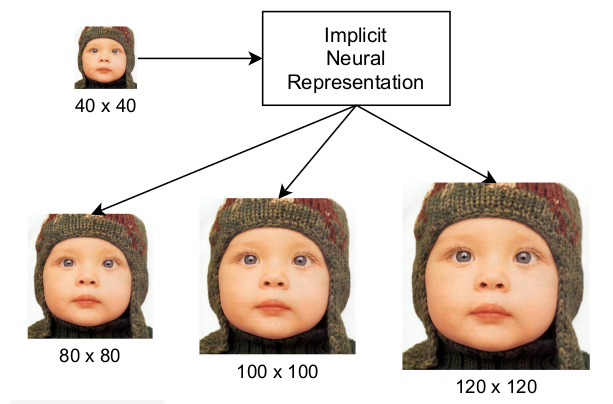
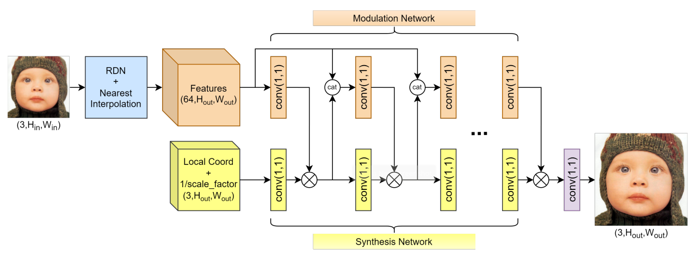

## Single Image Super-Resolution via a Dual Interactive Implicit Neural Network

### Overview


Single image super-resolution (SISR) is a fundamental low-level computer vision
problem that aims to recover a high-resolution image from its low-resolution
counterpart. There are two main reasons for performing SISR: (i) to enhance the
visual quality of an image for human consumption, and (ii) to improve the
representation of an image for machine perception. SISR has many practical
applications including robotics, remote sensing, satellite imaging, thermal
imaging, medical imaging, and much more.

This repository provides source code for our 2023 WACV paper titled "[Single
Image Super-Resolution via a Dual Interactive Implicit Neural Network]()." Our
dual interactive implicit neural network (DIINN) is capable of producing images
of arbitrary resolution, using a single trained model, by capturing the
underlying implicit representation of the input image. DIINN achieves
state-of-the-art SISR results on extensive experimental evaluations across many
settings and datasets. 

### Citation
If you find this project useful, then please consider citing our work.

```bibitex
@inproceedings{nguyen2023single,
  title={Single Image Super-Resolution via a Dual Interactive Implicit Neural Network},
  author={Nguyen, Quan H. and Beksi, William J},
  booktitle={Proceedings of the IEEE/CVF Winter Conference on Applications of Computer Vision (WACV)},
  pages={},
  year={2023}
}
```

### Model Architecture


### Installation 
First, clone the project

    $ git clone https://github.com/robotic-vision-lab/Dual-Interactive-Implicit-Neural-Network.git
    $ cd Dual-Interactive-Implicit-Neural-Network

Then, create a running environment via conda

    $ conda create -n myenv python=3.8
    $ conda activate myenv

Finally, install the software requirements

    $ conda install pytorch torchvision cudatoolkit=11.6 -c pytorch -c conda-forge
    $ conda install pytorch-lightning -c conda-forge
    $ conda install omegaconf rich -c conda-forge

### Datasets 
The following datasets are used to evaluate this work:

* [DIV2K](https://data.vision.ee.ethz.ch/cvl/DIV2K/)

* [Set5](http://people.rennes.inria.fr/Aline.Roumy/results/SR_BMVC12.html)

* [Set14](https://sites.google.com/site/romanzeyde/research-interests)

* [B100](https://www2.eecs.berkeley.edu/Research/Projects/CS/vision/bsds/)

* [Urban100](https://github.com/jbhuang0604/SelfExSR)

The data folder structure should be the following:

```
├── data
│   ├── DIV2K
│   │   ├── DIV2K_train_HR
│   │       │── 0001.png
|   |       │── ...
|   |       │── 0900.png
│   └── benchmark
│       ├── Set5
|       |   ├── HR
|       |       ├── ...
|       ├── Set14
|       |   ├── HR
|       |       ├── ...
|       ├── B100
|       |   ├── HR
|       |       ├── ...
|       └── Urban100
|           ├── HR
|               ├── ...
└── ...
```
### Usage

#### Training
To train a model with the default configuration located in
[configs/default.yaml](configs/default.yaml), run the following command 

    $ python main.py fit -c configs/default_test.yaml --model=SRLitModule --model.arch=diinn --model.mode=3 --model.init_q=False --trainer.logger=TensorBoardLogger --trainer.logger.save_dir=logs/ --trainer.logger.name=3_0

You may edit [configs/default.yaml](configs/default.yaml) to best utilize your
machine resources. For example, --model.mode=3 and --model.init_q=False is the
configuration of our final model (i.e., model (f) in the paper).

#### Benchmarks

To benchmark a trained model with the datasets used in the paper, run

    $ python benchmarks.py --ckpt_path=<path_to_checkpoint>

#### Super-Resolution

A low-resolution image can be super-resolved to a desired resolution as follows

    $ python demo2.py --lr_path=<path_to_lr_image> --ckpt_path=<path_to_ckpt> --output_size <height> <width>

### License

[](https://github.com/robotic-vision-lab/Dual-Interactive-Implicit-Neural-Network/blob/main/LICENSE)
